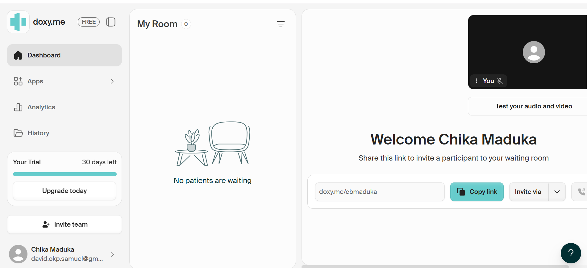
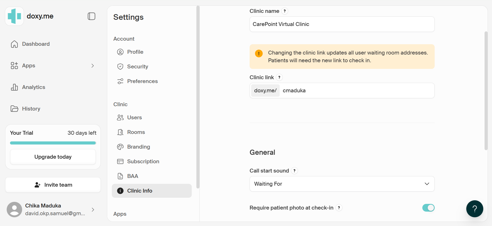
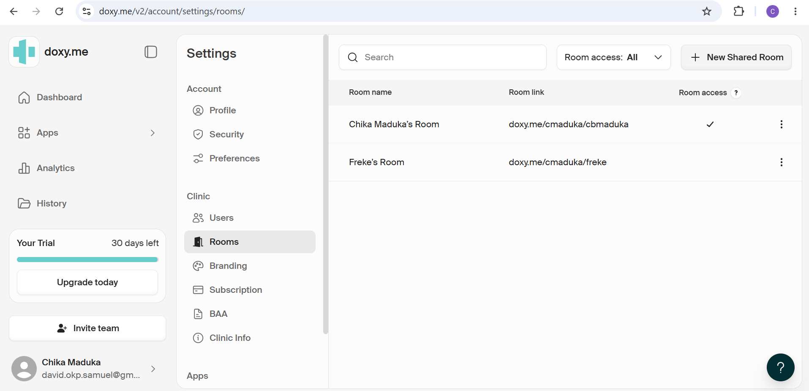
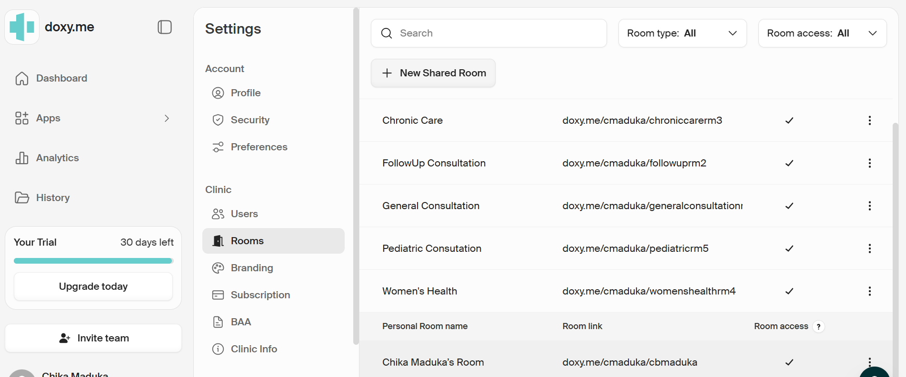
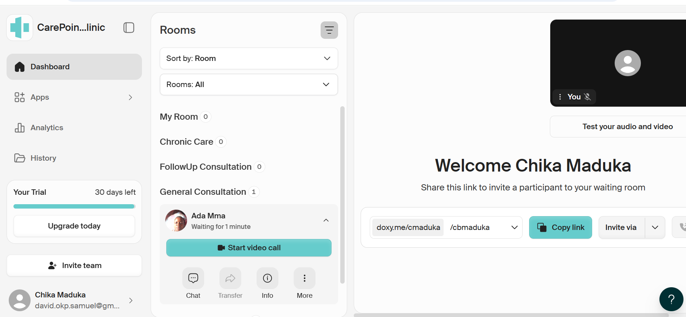
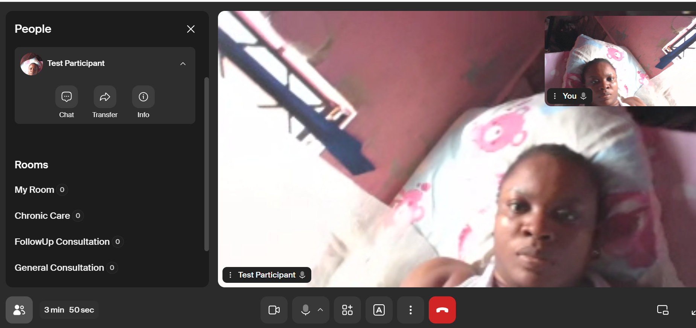
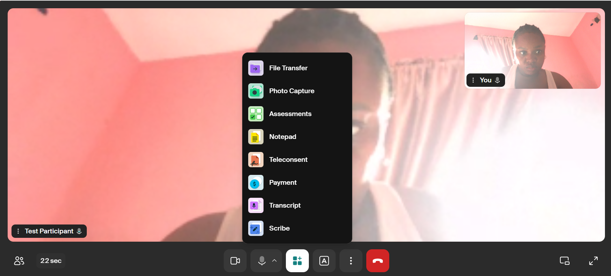
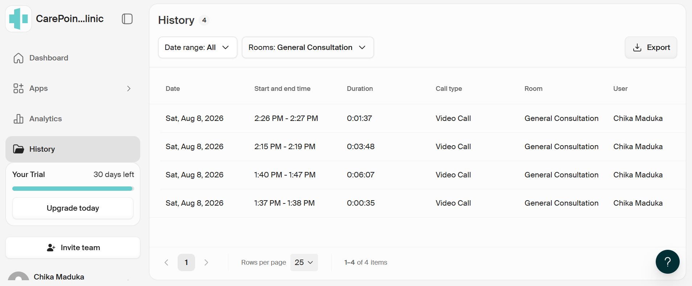
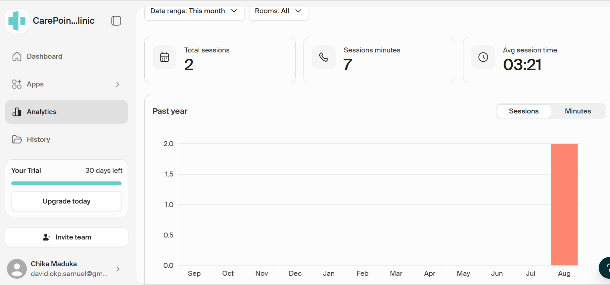

# 🩺 CarePoint Virtual Clinic
## Doxy.me Telehealth Clinic Implementation

A practical telehealth implementation demonstrating the configuration and testing of a structured virtual clinic environment using **Doxy.me**.

The project covers the complete virtual-care workflow, from clinic and consultation-room configuration to patient check-in, waiting-room management, live video consultation, clinical tools, session history, and operational analytics.

> **Project Focus:** Telehealth Operations • Virtual Clinic Configuration • Patient Workflow • Clinical Tools • Healthcare Technology

---

## 📌 Project Overview

**CarePoint Virtual Clinic** was configured as a multi-service telehealth environment designed to support organized virtual consultations.

Rather than demonstrating Doxy.me as a simple video-calling platform, this implementation focuses on how the platform can be structured around an operational patient journey.

The project demonstrates:

- Virtual clinic configuration
- Provider and shared consultation rooms
- Multiple consultation service areas
- Patient check-in and waiting-room workflow
- Provider waiting-queue management
- Live video consultation
- In-session clinical applications
- Consultation history
- Session analytics
- End-to-end workflow testing

All testing was performed using test participants. No real patient medical information was used.

---

# 🏥 Inside the Virtual Clinic

The implementation began with the creation of a structured clinic workspace and consultation environment.

<table>
<tr>
<td width="50%" valign="top">

### Clinic Dashboard

The provider dashboard acts as the operational center of the virtual clinic, providing access to consultation rooms, waiting participants, applications, analytics, and session history.



</td>
<td width="50%" valign="top">

### Clinic Configuration

CarePoint Virtual Clinic was configured with clinic-level information and settings to establish the virtual-care workspace.



</td>
</tr>
</table>

---

# 🚪 Consultation Room Architecture

The clinic was organized using provider and shared consultation rooms so that virtual appointments could be separated according to service type.

<table>
<tr>
<td width="50%" valign="top">

### Provider Rooms

Individual provider-room functionality was incorporated into the clinic structure, providing a dedicated consultation environment alongside shared clinic rooms.



</td>
<td width="50%" valign="top">

### Shared Telehealth Rooms

Shared rooms were configured to represent different virtual consultation services within CarePoint Virtual Clinic.



</td>
</tr>
</table>

### Configured Consultation Services

| Consultation Room | Purpose |
|---|---|
| **General Consultation** | Routine virtual consultations |
| **FollowUp Consultation** | Follow-up appointments |
| **Chronic Care** | Ongoing chronic-care consultations |
| **Women's Health** | Women's health consultations |
| **Pediatric Consultation** | Pediatric consultations |

This structure demonstrates how a single telehealth clinic can organize different virtual-care workflows without requiring a separate platform for each service.

---

# 👤 Patient Journey

The **General Consultation** room was used to test the complete patient journey.

The workflow followed:

**Consultation Link → Patient Check-In → Waiting Room → Provider Queue → Video Consultation → Clinical Tools → Session Completion**

### Patient Waiting Queue

After completing the check-in process, the test participant successfully appeared in the provider's General Consultation waiting queue.



The provider could identify the waiting participant and initiate the consultation directly from the dashboard.

---

# 🎥 Live Telehealth Consultation

The workflow was tested through an actual video connection between the provider environment and a test participant.



The active consultation interface provided access to:

- Camera controls
- Microphone controls
- Participant management
- Chat
- Clinical applications
- Additional session controls
- Call termination

This confirmed that the configured patient journey successfully progressed from virtual arrival to an active telehealth session.

---

# 🧰 Clinical Tools During Consultation

The clinic was extended beyond basic video communication by configuring applications that can support activities during a telehealth appointment.



### Configured Applications

| Tool | Workflow Function |
|---|---|
| **File Transfer** | Supports secure file exchange |
| **Photo Capture** | Supports appointment-related image capture |
| **Assessments** | Provides access to supported clinical assessments |
| **Notepad** | Supports private session note-taking |
| **Teleconsent** | Supports digital patient consent workflows |
| **Payment** | Provides patient payment functionality |
| **Transcript** | Provides written session records where available |
| **Scribe** | Supports automated session summarization where available |

The applications were accessible from within the live consultation interface, demonstrating how supporting clinical and administrative activities can be incorporated into the virtual visit.

---

# 📊 From Consultation to Operational Data

The implementation also tested what happens **after** the virtual consultation.

<table>
<tr>
<td width="50%" valign="top">

### Consultation History

Completed sessions were captured in the History area with information including session date, time, duration, call type, consultation room, and provider.



</td>
<td width="50%" valign="top">

### Session Tracking

The completed consultations generated measurable activity that could subsequently be reviewed through the clinic's analytics environment.

This closes the operational loop between:

**Patient Visit → Completed Session → Historical Record → Performance Data**

</td>
</tr>
</table>

---

# 📈 Telehealth Analytics

Session activity generated during testing was reflected in the Doxy.me analytics dashboard.



The dashboard provided visibility into metrics such as:

- Total sessions
- Session minutes
- Average session time
- Session activity over time

This provides an operational view of telehealth activity beyond individual patient encounters.

---

# 🔄 End-to-End Workflow

The completed implementation demonstrates the following operational flow:

```text
CarePoint Virtual Clinic
        │
        ▼
Consultation Room
        │
        ▼
Patient Access & Check-In
        │
        ▼
Virtual Waiting Room
        │
        ▼
Provider Waiting Queue
        │
        ▼
Live Video Consultation
        │
        ▼
Clinical & Administrative Tools
        │
        ▼
Session Completion
        │
        ├──────────────► Consultation History
        │
        └──────────────► Analytics
```

---

# 🧪 Implementation Testing

The environment was tested across the major components selected for this portfolio implementation.

| Test Area | Result |
|---|:---:|
| Clinic workspace configuration | ✅ Passed |
| Consultation-room availability | ✅ Passed |
| Patient check-in | ✅ Passed |
| Waiting-room queue | ✅ Passed |
| Provider identification of waiting participant | ✅ Passed |
| Video consultation connection | ✅ Passed |
| In-session clinical tools | ✅ Passed |
| Consultation history | ✅ Passed |
| Analytics reporting | ✅ Passed |

Testing used non-clinical test participants and did not involve real patient medical information.

---

# 📚 Project Documentation

Detailed implementation documentation is available in the `docs` directory:

| Document | Description |
|---|---|
| [01 – Project Overview](docs/01-project-overview.md) | Project scope, objectives, clinic structure, and outcome |
| [02 – Clinic Configuration](docs/02-clinic-configuration.md) | Clinic workspace and configuration approach |
| [03 – Telehealth Rooms](docs/03-telehealth-rooms.md) | Provider rooms, shared rooms, and waiting-room structure |
| [04 – Patient Workflow](docs/04-patient-workflow.md) | End-to-end virtual patient journey |
| [05 – Clinical Tools](docs/05-clinical-tools.md) | In-session applications and supporting functionality |
| [06 – Testing and Results](docs/06-testing-and-results.md) | Implementation validation and test results |

---

# 🗂️ Repository Structure

```text
doxyme-telehealth-clinic-implementation/
│
├── README.md
│
├── docs/
│   ├── 01-project-overview.md
│   ├── 02-clinic-configuration.md
│   ├── 03-telehealth-rooms.md
│   ├── 04-patient-workflow.md
│   ├── 05-clinical-tools.md
│   └── 06-testing-and-results.md
│
└── screenshots/
    ├── 01-doxyme-dashboard.png
    ├── 02-clinic-information.png
    ├── 03-provider-rooms.png
    ├── 04-shared-telehealth-rooms.png
    ├── 05-patient-waiting-queue.png
    ├── 06-live-video-consultation.png
    ├── 07-consultation-history.png
    ├── 08-clinical-tools-during-telehealth-session.png
    └── 09-telehealth-session-analytics.png
```

---

# 💼 Skills Demonstrated

This project demonstrates practical experience in:

- Telehealth platform configuration
- Healthcare technology implementation
- Virtual clinic operations
- Patient workflow design
- Digital patient check-in
- Virtual waiting-room management
- Telehealth consultation workflows
- Clinical application configuration
- Healthcare operations
- Workflow testing and validation
- Session monitoring and analytics
- Process documentation

---

# 🔐 Privacy & Test Environment

This repository is a **portfolio implementation project** demonstrating platform configuration and workflow design.

No real patient records, protected health information, or clinical case data were used in the project.

Test participants and non-clinical test activity were used to demonstrate the configured workflows.

---

# 👩🏾‍💼 About the Project

**Platform:** Doxy.me  
**Environment:** CarePoint Virtual Clinic  
**Implementation:** Chika Blessing  
**Focus:** Healthcare Operations & Telehealth Workflow Implementation

This project forms part of a broader portfolio demonstrating practical implementation experience across healthcare technology, CRM, project management, workflow automation, and business operations.

---

### Same warmth, wherever you find me.
